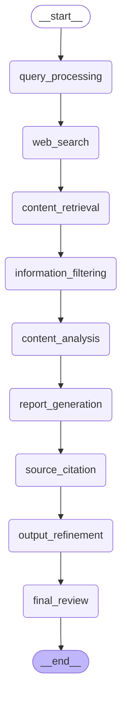

```mermaid
%%{init: {'flowchart': {'curve': 'linear'}}}%%
graph TD;
	__start__([__start__]):::first
	query_processing(query_processing)
	web_search(web_search)
	content_retrieval(content_retrieval)
	information_filtering(information_filtering)
	content_analysis(content_analysis)
	report_generation(report_generation)
	source_citation(source_citation)
	output_refinement(output_refinement)
	final_review(final_review)
	__end__([__end__]):::last
	__start__ --> query_processing;
	content_analysis --> report_generation;
	content_retrieval --> information_filtering;
	final_review --> __end__;
	information_filtering --> content_analysis;
	output_refinement --> final_review;
	query_processing --> web_search;
	report_generation --> source_citation;
	source_citation --> output_refinement;
	web_search --> content_retrieval;
	classDef default fill:#f2f0ff,line-height:1.2
	classDef first fill-opacity:0
	classDef last fill:#bfb6fc
```